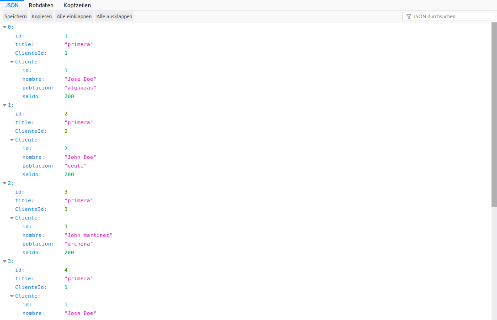
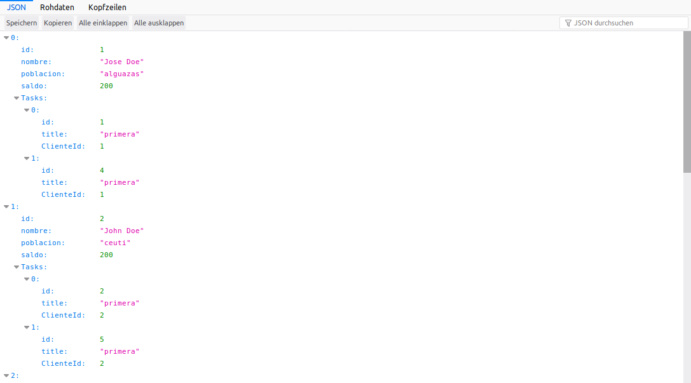

# sequelize_association
simple asociacion de 1:n  - hasMany / belongTo

Globally

Install CLI globally with
```ruby
$ npm install -g sequelize-cli

// Hay realizar todos estos procesos para inicializar las tablas.Con estos procesos
// primero inicializamos  la tabla Clientes y despues la tabla Tasks

$ npm start
$ sequelize db:seed:all
$ npm start
$ sequelize db:seed:all
$ npm start
```

Con http://miip:3000/users/Task obtenemos:



Para obtener un listado de clientes con todas sus tareas tendriamos que poner:

```ruby
router.get("/Task",(req,res)=>{
Cliente.findAll({
  include: [{
      model: Task
     
  }]
}).then((result)=> res.json(result))
});

```



# operators
Para utilizar clausulas "where" con  operators de sequelize

- Eliminar la entrada "operatorsAliases": false  en  en archivo /config/config.json.
- Agregar las entradas en el archivo /routes/users.js lo siguiente:
    ```ruby
    const db=require('../models');
    const Op = db.Sequelize.Op;
       --------------
       
     router.get("/Task",(req,res)=>{
     Cliente.findAll({
         include: [{
          model: Task,
      
     }],
     where:{poblacion:{[Op.eq]:["alguazas"]}}
 
   }).then((result)=> res.json(result))
   });  
   ```
 O tambien:
 ```ruby
 router.get("/Task",(req,res)=>{
  let busqueda="%"+"algu"+"%";
 Cliente.findAll({
    include: [{
       model: Task,
      
  }],
  where:{poblacion:{[Op.like]:[busqueda]}}
 
}).then((result)=> res.json(result))
});
```
